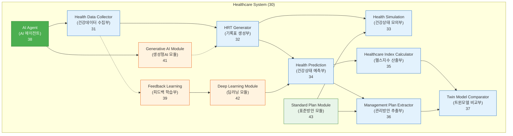
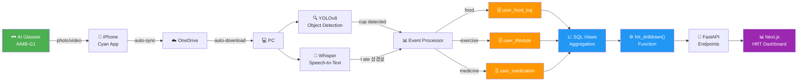
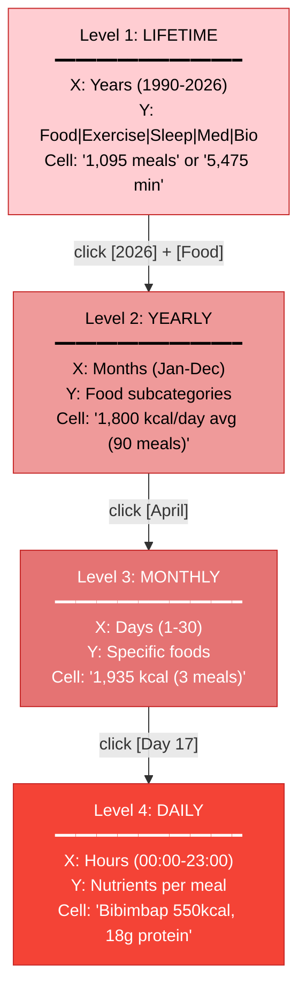
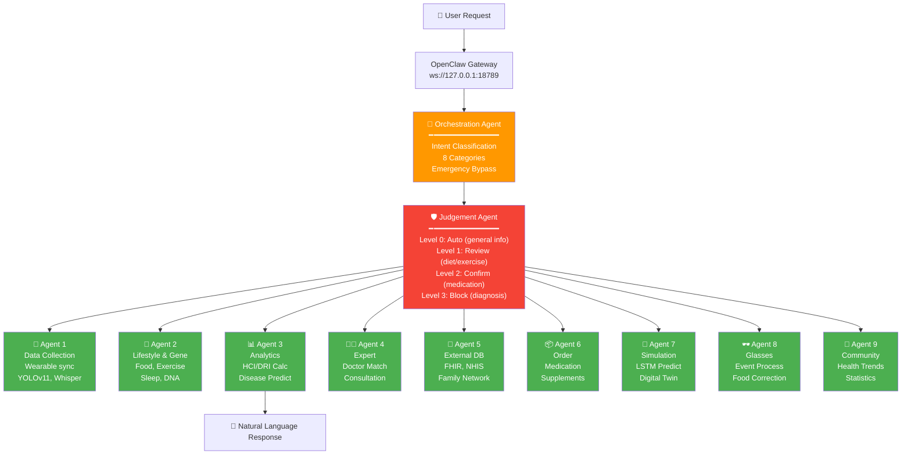
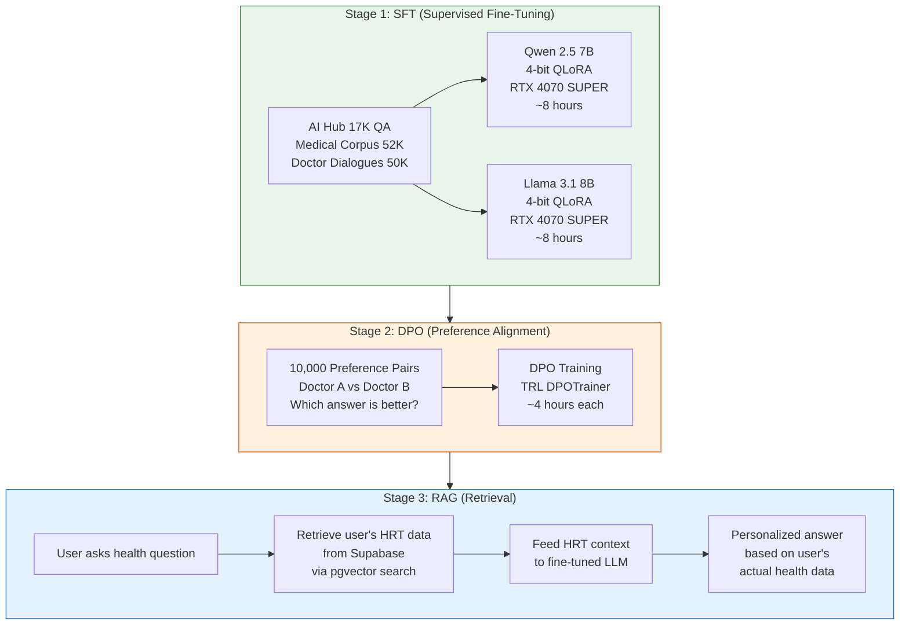

# Healthcare AI Agent - System Block Diagrams
# Copy each diagram code into: https://mermaid.live or ChatGPT or Claude

---

## Diagram 1: Patent System Block Diagram (도 3 style - matching boss's picture)

---

## Diagram 2: Complete 7-Layer System Architecture

```mermaid
graph TB
    subgraph L1["Layer 1: Data Collection"]
        G["AI Glasses<br/>AIMB-G1<br/>8MP Camera"]
        W["Smart Watch<br/>HR, SpO2<br/>Steps"]
        C["CGM<br/>Glucose<br/>Dexcom/Libre"]
        P["Phone Camera<br/>Food Photos"]
        V["Voice Input<br/>Whisper STT"]
    end

    subgraph L2["Layer 2: AI Processing"]
        Y["YOLOv8n<br/>80 Objects<br/>cup/bowl/food"]
        WH["Whisper Base<br/>Korean+English<br/>Speech-to-Text"]
        EF["EfficientNetV2-S<br/>150 Korean Foods<br/>TRAINING"]
        MF["MFDS Lookup<br/>275,856 Foods"]
        LLM["LLM Extraction<br/>Gemini Flash<br/>PENDING"]
    end

    subgraph L3["Layer 3: Supabase Database"]
        T["38 Tables<br/>user_food_log<br/>user_lifestyle<br/>user_biometric<br/>user_medication"]
        VW["6 SQL Views<br/>hrt_yearly_summary<br/>hrt_monthly_food<br/>hrt_daily_food"]
        FN["hrt_drilldown()<br/>Database Function<br/>4-Level Query"]
        IX["42 Indexes<br/>45 RLS Policies"]
    end

    subgraph L4["Layer 4: HRT Drill-Down"]
        D1["Level 1<br/>Years<br/>Birth→120"]
        D2["Level 2<br/>Months<br/>1월→12월"]
        D3["Level 3<br/>Days<br/>1→31"]
        D4["Level 4<br/>Hours<br/>00:00→23:00"]
    end

    subgraph L5["Layer 5: Forecasting"]
        LSTM["LSTM-Transformer<br/>65-dim Input"]
        MIRA["MIRA<br/>Microsoft 455M"]
        TFM["TimesFM<br/>Google 200M"]
        CB["Chronos-Bolt<br/>Amazon 200M"]
        TFT["TFT<br/>Interpretable"]
    end

    subgraph L6["Layer 6: AI Agents (11)"]
        OA["Orchestration<br/>Agent"]
        JA["Judgement<br/>Agent"]
        A1["Data<br/>Collection"]
        A2["Lifestyle<br/>& Gene"]
        A3["Analytics<br/>HCI/DRI"]
        A4["Expert<br/>Doctor"]
        A5["External<br/>DB/FHIR"]
        A6["Order"]
        A7["Simulation"]
        A8["Glasses"]
        A9["Community"]
        OA --> JA
        JA --> A1
        JA --> A2
        JA --> A3
        JA --> A4
    end

    subgraph L7["Layer 7: Frontend"]
        HD["HRT Dashboard<br/>Next.js"]
        MA["Mobile App<br/>React Native"]
        GH["Glasses HUD"]
        WC["Web Chat"]
    end

    L1 --> L2
    L2 --> L3
    L3 --> L4
    L3 --> L5
    L5 --> L6
    L4 --> L7
    L6 --> L7

    style L1 fill:#E8F5E9,stroke:#2E7D32
    style L2 fill:#E3F2FD,stroke:#1565C0
    style L3 fill:#FFF3E0,stroke:#E65100
    style L4 fill:#FCE4EC,stroke:#C62828
    style L5 fill:#F3E5F5,stroke:#6A1B9A
    style L6 fill:#E0F2F1,stroke:#00695C
    style L7 fill:#FFFDE7,stroke:#F57F17
```

---

## Diagram 3: Database Table Relationships (ERD)

```mermaid
erDiagram
    users ||--o{ user_food_log : "has"
    users ||--o{ user_lifestyle : "has"
    users ||--o{ user_biometric : "has"
    users ||--o{ user_diagnosis : "has"
    users ||--o{ user_medication : "has"
    users ||--o{ user_health_level : "has"
    users ||--o{ user_activity_event : "has"
    users ||--o{ user_genomic : "has"
    users ||--o{ user_multimodal : "has"
    users ||--o{ agent_conversation_log : "has"
    users ||--o{ simulation_result : "has"
    users ||--o{ consultations : "has"
    users ||--o{ external_records : "has"
    users ||--o{ family_relations : "has"
    users ||--o{ family_history : "has"
    users ||--o{ twin_comparisons : "has"

    experts ||--o{ consultations : "provides"
    simulation_result ||--o{ twin_comparisons : "compared_in"
    std_population_category ||--o{ std_diagnosis_norm : "defines"
    std_population_category ||--o{ std_lifestyle_plan : "defines"
    std_population_category ||--o{ std_disease_risk_weight : "defines"
    hrt_categories ||--o{ hrt_categories : "parent"

    users {
        bigint user_id PK
        uuid user_token
        varchar age_group
        char gender
        int birth_year
        boolean is_active
    }
    user_food_log {
        bigint food_id PK
        bigint user_id FK
        timestamptz consumed_at
        varchar food_name
        jsonb nutrients_json
        float confidence
    }
    user_lifestyle {
        bigint ls_id PK
        bigint user_id FK
        date recorded_date
        int total_calories
        int exercise_min
        float sleep_hours
    }
    user_biometric {
        bigint bio_id PK
        bigint user_id FK
        timestamptz measured_at
        int heart_rate
        float spo2
        float glucose_mgdl
    }
    user_medication {
        bigint med_id PK
        bigint user_id FK
        varchar drug_code
        varchar drug_name
        numeric dose
        boolean interaction_flag
    }
    user_health_level {
        bigint hl_id PK
        bigint user_id FK
        float healthcare_index
        float dri
        jsonb disease_risk_json
    }
```

---

## Diagram 4: Data Flow (Glasses to Dashboard)

---

## Diagram 5: HRT Drill-Down Levels

---

## Diagram 6: Multi-Agent Architecture

---

## Diagram 7: Forecasting Pipeline

```mermaid
flowchart LR
    subgraph Input["HRT Input Data (65 dimensions)"]
        D1["Sociodemographic<br/>age, gender<br/>4 dims"]
        D2["Lifestyle<br/>calories, exercise<br/>sleep, alcohol<br/>7 dims"]
        D3["Diagnostic<br/>BMI, BP, glucose<br/>cholesterol, etc<br/>44 dims"]
        D4["Glasses-Derived<br/>meal count, hydration<br/>portion confidence<br/>10 dims"]
    end

    Input --> Ensemble

    subgraph Ensemble["5-Model Ensemble"]
        M1["LSTM-Transformer<br/>Custom"]
        M2["MIRA<br/>Microsoft 455M"]
        M3["TimesFM<br/>Google 200M"]
        M4["Chronos-Bolt<br/>Amazon 200M"]
        M5["TFT<br/>Interpretable"]
    end

    Ensemble --> Output

    subgraph Output["Predictions"]
        P1["30 Days<br/>BMI: 24.1→24.3"]
        P2["1 Year<br/>Glucose: 95→102"]
        P3["10 Years<br/>Diabetes: 5%→15%"]
    end

    Output --> Twin["Digital Twin<br/>Compare vs<br/>Role Model"]
    Twin --> HCI["HCI Score<br/>T = a(X-X0) + b(Y-Y0)<br/>+ c(Z-Z0) - d(E-E0)<br/>+ e(N-N0) + f(M)"]

    style Input fill:#E3F2FD,stroke:#1565C0
    style Ensemble fill:#FFF3E0,stroke:#E65100
    style Output fill:#FCE4EC,stroke:#C62828
    style Twin fill:#E8F5E9,stroke:#2E7D32
    style HCI fill:#4CAF50,color:#fff
```

---

## Diagram 8: LLM Training Pipeline

---

# How to render these diagrams:

## Option 1: Mermaid Live Editor (FREE, instant)
1. Go to https://mermaid.live
2. Paste any diagram code above
3. See the visual diagram instantly
4. Click "Download PNG" to save as image

## Option 2: ChatGPT / Claude
1. Paste the Mermaid code
2. Ask: "Render this Mermaid diagram as an image"

## Option 3: VS Code Extension
1. Install "Mermaid Preview" extension
2. Open this .md file
3. Preview shows all diagrams

## Option 4: GitHub
1. Push this file to GitHub
2. GitHub automatically renders Mermaid diagrams
